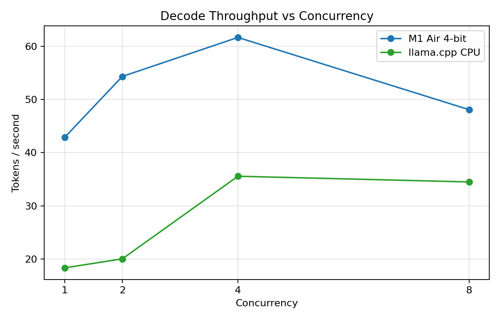
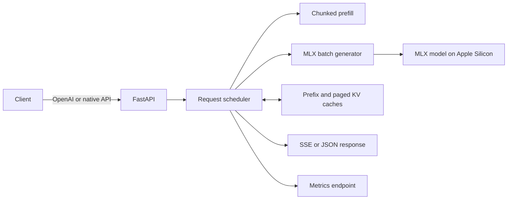

# vLLM-like LLM Serving on Apple Silicon

[](https://www.python.org/)
[](https://github.com/ml-explore/mlx)
[](https://fastapi.tiangolo.com/)
[](#openai-compatible-api)
[](https://github.com/nandanadileep/vllm-like-llm-serving/stargazers)

A compact, educational LLM inference server that brings vLLM-inspired serving ideas to Apple Silicon with [MLX](https://github.com/ml-explore/mlx). Run a local OpenAI-compatible API and explore continuous batching, chunked prefill, prefix KV caching, paged KV storage, streaming, and speculative decoding—without a CUDA GPU.

> This is an experimental learning and benchmarking project, not a drop-in reimplementation of vLLM. See [How it compares to vLLM](#how-it-compares-to-vllm) for the important differences.

[Read the engineering write-up](https://medium.com/@nandanadileep29/building-a-vllm-inspired-llm-serving-engine-on-apple-silicon-with-mlx-65b0576ebd05) · [Explore the API docs](http://127.0.0.1:8000/docs) · [View benchmark results](#benchmarks)



## Why this project?

Production LLM serving systems can be difficult to study because their core ideas are spread across schedulers, cache managers, model runtimes, and specialized GPU kernels. This repository keeps those concepts small enough to inspect while still running real Llama inference on a Mac.

Use it to:

- learn how request scheduling and continuous batching affect throughput;
- experiment with KV-cache allocation, prefix reuse, and chunked prefill;
- serve an MLX model through familiar OpenAI-style chat completions;
- compare Apple Silicon inference with vLLM on a GPU and llama.cpp on a CPU; and
- measure latency, time to first token (TTFT), throughput, memory, and cache behavior.

## Features

- **Real MLX inference** with `mlx-community/Llama-3.2-1B-Instruct-4bit` by default
- **OpenAI-compatible chat completions** at `/v1/chat/completions`
- **SSE streaming** for both the native and chat-completions APIs
- **Continuous batching experiments** using MLX batch generation
- **Chunked prefill** with configurable token chunk size
- **Prefix KV cache** with exact and shared-prefix reuse
- **Paged KV cache experiments** with block allocation and fragmentation metrics
- **Optional gathered paged KV backing store** re-materialized for dense attention
- **Optional speculative decoding** with a configurable draft model
- **Built-in observability** for TTFT, queueing, cache hits, blocks, tokens, and memory
- **Reproducible load tests and plots** against vLLM and llama.cpp baselines

## Architecture



## Quick start

### Requirements

- An Apple Silicon Mac (M1 or newer)
- Python 3.10 or newer
- Enough disk space and unified memory for the selected MLX model

```bash
git clone https://github.com/nandanadileep/vllm-like-llm-serving.git
cd vllm-like-llm-serving

python3 -m venv .venv
source .venv/bin/activate
pip install -r requirements.txt

uvicorn server.app:app --host 127.0.0.1 --port 8000
```

The first request may take longer while the default model is downloaded and loaded. Once the server is ready, check it with:

```bash
curl http://127.0.0.1:8000/health
```

Interactive API documentation is available at <http://127.0.0.1:8000/docs>.

## OpenAI-compatible API

Use any HTTP client that can call an OpenAI-style `/v1/chat/completions` endpoint:

```bash
curl http://127.0.0.1:8000/v1/chat/completions \
  -H "Content-Type: application/json" \
  -d '{
    "model": "mlx-community/Llama-3.2-1B-Instruct-4bit",
    "messages": [
      {"role": "user", "content": "Explain continuous batching in one paragraph."}
    ],
    "max_tokens": 120,
    "stream": false
  }'
```

For server-sent event streaming, set `"stream": true`.

### Native API

```bash
curl http://127.0.0.1:8000/generate \
  -H "Content-Type: application/json" \
  -d '{
    "prompt": "Apple Silicon is useful for local LLM inference because",
    "user_id": "demo",
    "max_tokens": 80
  }'
```

Available endpoints:

| Method | Endpoint | Purpose |
| --- | --- | --- |
| `GET` | `/health` | Readiness check |
| `POST` | `/generate` | Native JSON generation |
| `GET`, `POST` | `/generate/stream` | Native SSE generation |
| `POST` | `/v1/chat/completions` | OpenAI-style chat completions |
| `GET` | `/metrics` | Scheduler, cache, token, and memory metrics |
| `GET` | `/docs` | Interactive OpenAPI documentation |

## Configuration

The server is configured with environment variables. Defaults work for a first run.

| Variable | Default | Description |
| --- | --- | --- |
| `MODEL_PATH` | `mlx-community/Llama-3.2-1B-Instruct-4bit` | MLX model repository or local path |
| `BATCH_SIZE` | `4` | Maximum requests admitted to a batch |
| `BATCH_TIMEOUT` | `0.05` | Seconds to wait while forming a batch |
| `PREFILL_CHUNK_SIZE` | `128` | Prompt tokens processed per prefill chunk |
| `PAGED_BLOCK_SIZE` | `16` | Token slots in a simulated KV block |
| `PAGED_NUM_BLOCKS` | `256` | Blocks in the simulated KV pool |
| `PREFIX_CACHE_ENABLED` | off | Enable prompt-cache reuse |
| `PREFIX_CACHE_MAX_ENTRIES` | `256` | Maximum cached prefixes |
| `PREFIX_CACHE_TTL_SEC` | `0` | Cache TTL; `0` disables expiry |
| `MLX_GLOBAL_BATCH_GENERATOR` | off | Enable long-lived continuous admission |
| `MLX_GATHER_PAGED_KV` | off | Enable gathered paged-KV backing storage |
| `GATHER_PAGED_NUM_BLOCKS` | `512` | Physical blocks in the gathered paged-KV store |
| `SPECULATIVE_DECODE` | off | Enable draft-model speculative decoding |
| `DRAFT_MODEL_PATH` | unset | Draft model used for speculative decoding |
| `NUM_DRAFT_TOKENS` | `4` | Draft tokens proposed per step |

Example:

```bash
PREFIX_CACHE_ENABLED=1 \
MLX_GLOBAL_BATCH_GENERATOR=1 \
BATCH_SIZE=8 \
uvicorn server.app:app --host 127.0.0.1 --port 8000
```

## Benchmarks

The included benchmark measures average and tail latency, TTFT, request throughput, token throughput, and memory across concurrency levels. The checked-in results compare:

- this MLX server on Apple Silicon;
- vLLM serving Llama 3.2 1B on a Colab GPU; and
- llama.cpp serving a quantized GGUF on CPU.

Run the local benchmark:

```bash
source .venv/bin/activate
python experiments/load_test.py
python experiments/plot_results.py
```

Add the optional baselines:

```bash
VLLM_URL=https://<your-ngrok-host>/v1 \
CPU_URL=http://127.0.0.1:8001/v1 \
python experiments/load_test.py

python experiments/plot_results.py
```

See the [vLLM Colab guide](docs/colab/vllm_llama32_server.md) for GPU setup. If a baseline URL is absent or unreachable, the benchmark skips it. Results are saved to [`experiments/latest_results.json`](experiments/latest_results.json) and [`experiments/plots/`](experiments/plots/).

<details>
<summary>llama.cpp CPU baseline setup</summary>

```bash
brew install llama.cpp
mkdir -p ~/models
hf download bartowski/Llama-3.2-1B-Instruct-GGUF \
  Llama-3.2-1B-Instruct-Q4_K_M.gguf \
  --local-dir ~/models

llama-server \
  --model ~/models/Llama-3.2-1B-Instruct-Q4_K_M.gguf \
  --port 8001 \
  --n-gpu-layers 0 \
  --ctx-size 2048
```

</details>

> Benchmark numbers are snapshots, not universal performance claims. Hardware, model format, runtime version, network tunneling, prompts, and generation settings differ between backends. Use the included harness to reproduce results on your own setup.

## How it compares to vLLM

| Capability | This project | vLLM |
| --- | --- | --- |
| Primary hardware | Apple Silicon via MLX | NVIDIA/AMD/Intel accelerators and more |
| Goal | Education and local experimentation | Production-scale serving |
| Batching | MLX batch generation and experimental continuous admission | Production continuous batching scheduler |
| Paged KV | Python block-pool simulation; optional gathered backing store | Fused, device-level paged attention |
| Parallelism | Single-machine experimentation | Distributed tensor/pipeline/data parallelism |
| API | Focused chat-completions subset plus native endpoints | Broad OpenAI-compatible serving surface |

This project borrows system-design ideas from vLLM, but it does **not** include CUDA kernels, fused paged-attention kernels, tensor parallelism, pipeline parallelism, or vLLM's production scheduler.

## Project structure

```text
server/                 FastAPI routes, scheduler, and cache experiments
experiments/            Load testing, saved results, and plots
docs/colab/             Optional vLLM GPU baseline guide
requirements.txt        Python dependencies
```

## Contributing

Bug reports, experiments, documentation improvements, and focused pull requests are welcome. Read [CONTRIBUTING.md](CONTRIBUTING.md) before opening a change. If this project helps you understand LLM serving, consider starring it or sharing the [engineering write-up](https://medium.com/@nandanadileep29/building-a-vllm-inspired-llm-serving-engine-on-apple-silicon-with-mlx-65b0576ebd05).

## Acknowledgements

Inspired by [vLLM](https://github.com/vllm-project/vllm), [Apple MLX](https://github.com/ml-explore/mlx), [MLX LM](https://github.com/ml-explore/mlx-lm), and [llama.cpp](https://github.com/ggml-org/llama.cpp).
